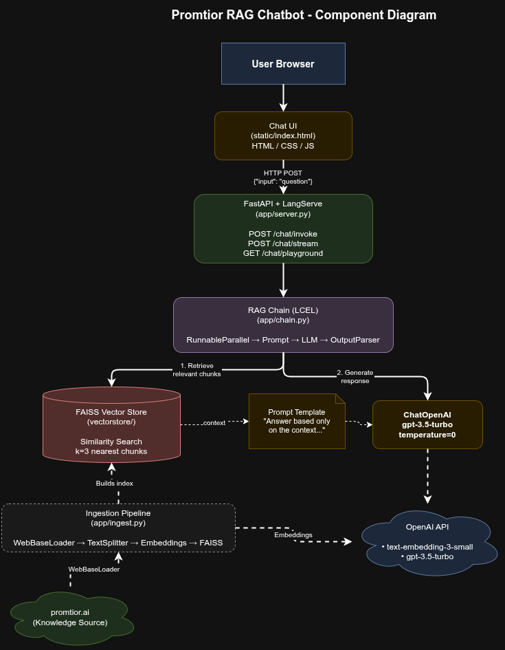

# Component Diagram

## Architecture Overview

## Component Descriptions

### 1. Frontend (static/index.html)
A self-contained HTML/CSS/JS chat interface that sends user questions to the API and displays responses. No external dependencies or build tools required. Links to the LangServe playground for advanced testing.

### 2. FastAPI + LangServe (app/server.py)
The web server that exposes the RAG chain as REST endpoints. LangServe's `add_routes()` automatically generates invoke, stream, and playground endpoints with input/output validation. Also serves the static frontend and auto-triggers ingestion on first startup if no vector index exists.

### 3. RAG Chain (app/chain.py)
The core processing pipeline built with LangChain Expression Language (LCEL). It runs two operations in parallel: the user's question is passed through unchanged, while the FAISS retriever finds the 3 most relevant document chunks. Both are fed into a prompt template that instructs the LLM to answer based only on the retrieved context. The response is parsed to plain text.

### 4. FAISS Vector Store (vectorstore/)
A local vector index that stores embeddings of the Promtior website content. Supports fast approximate nearest-neighbor search. Generated at build/startup time and persisted to disk. Does not require an external database server.

### 5. Ingestion Pipeline (app/ingest.py)
Responsible for building the vector store. Loads web pages from Promtior's website, splits the text into overlapping chunks of 500 characters, converts each chunk to a 1536-dimensional vector using OpenAI embeddings, and stores them in FAISS.

### 6. OpenAI API (External)
Provides two services: (a) embedding generation via `text-embedding-3-small` for both ingestion and query-time vector conversion, and (b) text generation via `gpt-3.5-turbo` for producing the final chatbot response.

## Data Flow Summary

1. **User** types a question in the chat UI
2. **Frontend** sends POST request to `/chat/invoke`
3. **LangServe** routes request to the RAG chain
4. **Retriever** converts question to embedding, searches FAISS for top-3 similar chunks
5. **Prompt** combines retrieved context + question
6. **LLM** generates an answer grounded in the context
7. **Response** flows back through LangServe to the frontend
